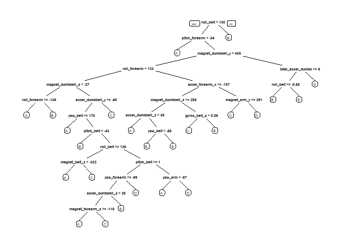

## Introduction

Using devices such as Jawbone Up, Nike FuelBand, and Fitbit it is now possible to collect a large amount of data about personal activity relatively inexpensively. These type of devices are part of the quantified self movement – a group of enthusiasts who take measurements about themselves regularly to improve their health, to find patterns in their behavior, or because they are tech geeks. One thing that people regularly do is quantify how much of a particular activity they do, but they rarely quantify how well they do it.

In this project, we will use data from accelerometers on the belt, forearm, arm, and dumbell of 6 participants to predict the manner in which they did the exercise.

## Load libraries

```r
library(caret)
```

```
## Loading required package: lattice
```

```
## Loading required package: ggplot2
```

```r
library(rpart)
library(rpart.plot)
library(randomForest)
```

```
## randomForest 4.6-14
```

```
## Type rfNews() to see new features/changes/bug fixes.
```

```
## 
## Attaching package: 'randomForest'
```

```
## The following object is masked from 'package:ggplot2':
## 
##     margin
```

```r
library(corrplot)
```

```
## corrplot 0.84 loaded
```

## Load Data

```r
setwd("C:\\Users\\user\\Downloads\\R-data")
trainfn = "pml-training.csv"
testfn = "pml-testing.csv"
trainDf <- read.csv(trainfn, sep=",", header=TRUE, na.strings = c("NA","",'#DIV/0!'))
testDf <- read.csv(testfn, sep=",", header=TRUE, na.strings = c("NA","",'#DIV/0!'))
```

```r
dim(trainDf)
```

```
## [1] 19622   160
```


```r
dim(testDf)
```

```
## [1]  20 160
```
### Clean the data
Clean data

```r
trainDf <- trainDf[, colSums(is.na(trainDf)) == 0]
testDf <- testDf[, colSums(is.na(testDf)) == 0]

classe <- trainDf$classe
trainRemove <- grepl("^X|timestamp|window", names(trainDf))
trainDf <- trainDf[, !trainRemove]
trainCleaned <- trainDf[, sapply(trainDf, is.numeric)]
trainCleaned$classe <- classe
testRemove <- grepl("^X|timestamp|window", names(testDf))
testDf <- testDf[, !testRemove]
testCleaned <- testDf[, sapply(testDf, is.numeric)]
```
### Split  data 
Split cleaned data set into training data sate (70%) and validation data set (30%)

```r
set.seed(22519) # For reproducibile purpose
inTrain <- createDataPartition(trainCleaned$classe, p=0.70, list=F)
trainData <- trainCleaned[inTrain, ]
testData <- trainCleaned[-inTrain, ]
```

## Modeling the data
First we fit predictive model using Random Forest (rf), using selection of important variables.
As parameter we use 5-fold cross validation with algorithm


```r
controlRf <- trainControl(method="cv", 5)
modelRf <- train(classe ~ ., data=trainData, method="rf", trControl=controlRf, ntree=250)
modelRf
```

```
## Random Forest 
## 
## 13737 samples
##    52 predictor
##     5 classes: 'A', 'B', 'C', 'D', 'E' 
## 
## No pre-processing
## Resampling: Cross-Validated (5 fold) 
## Summary of sample sizes: 10989, 10991, 10988, 10989, 10991 
## Resampling results across tuning parameters:
## 
##   mtry  Accuracy   Kappa    
##    2    0.9909729  0.9885802
##   27    0.9914091  0.9891325
##   52    0.9849311  0.9809363
## 
## Accuracy was used to select the optimal model using the largest value.
## The final value used for the model was mtry = 27.
```

We check model on validation set

```r
predictRf <- predict(modelRf, testData)
confusionMatrix(testData$classe, predictRf)
```

```
## Confusion Matrix and Statistics
## 
##           Reference
## Prediction    A    B    C    D    E
##          A 1673    0    0    0    1
##          B    6 1129    4    0    0
##          C    0    0 1021    5    0
##          D    0    0   15  948    1
##          E    0    0    0    6 1076
## 
## Overall Statistics
##                                           
##                Accuracy : 0.9935          
##                  95% CI : (0.9911, 0.9954)
##     No Information Rate : 0.2853          
##     P-Value [Acc > NIR] : < 2.2e-16       
##                                           
##                   Kappa : 0.9918          
##  Mcnemar's Test P-Value : NA              
## 
## Statistics by Class:
## 
##                      Class: A Class: B Class: C Class: D Class: E
## Sensitivity            0.9964   1.0000   0.9817   0.9885   0.9981
## Specificity            0.9998   0.9979   0.9990   0.9968   0.9988
## Pos Pred Value         0.9994   0.9912   0.9951   0.9834   0.9945
## Neg Pred Value         0.9986   1.0000   0.9961   0.9978   0.9996
## Prevalence             0.2853   0.1918   0.1767   0.1630   0.1832
## Detection Rate         0.2843   0.1918   0.1735   0.1611   0.1828
## Detection Prevalence   0.2845   0.1935   0.1743   0.1638   0.1839
## Balanced Accuracy      0.9981   0.9989   0.9903   0.9926   0.9984
```

### Visualization of decission tree
<!-- -->


```r
accuracy <- postResample(predictRf, testData$classe)
accuracy
```

```
##  Accuracy     Kappa 
## 0.9935429 0.9918320
```
Estimated out-of-sample error

```r
err <- 1 - as.numeric(confusionMatrix(testData$classe, predictRf)$overall[1])
err
```

```
## [1] 0.006457094
```

## Apply model on testing data


```r
result <- predict(modelRf, testCleaned[, -length(names(testCleaned))])
result
```

```
##  [1] B A B A A E D B A A B C B A E E A B B B
## Levels: A B C D E
```


